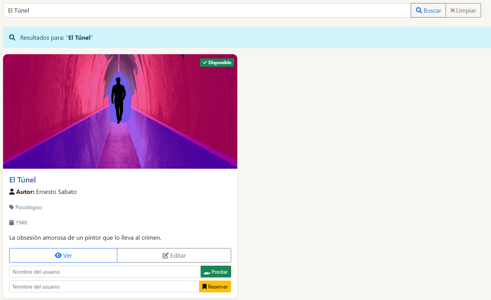
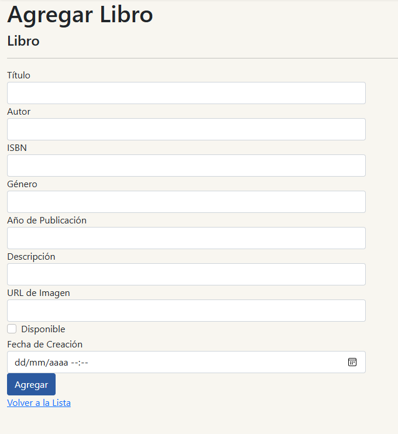
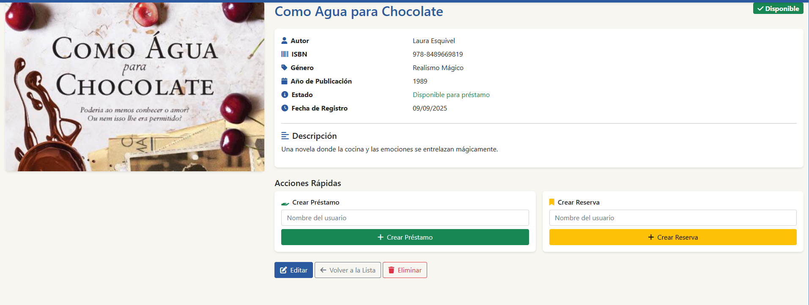
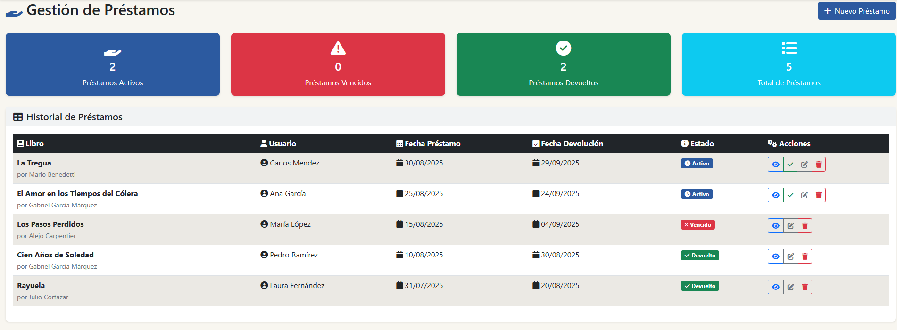
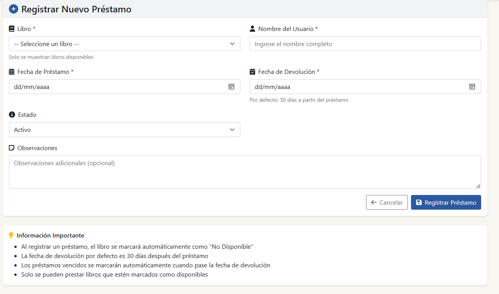
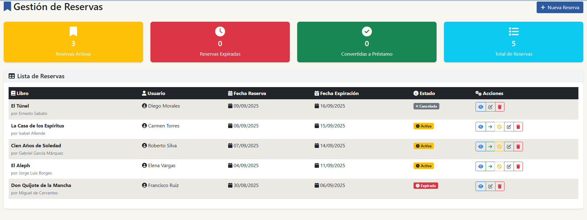
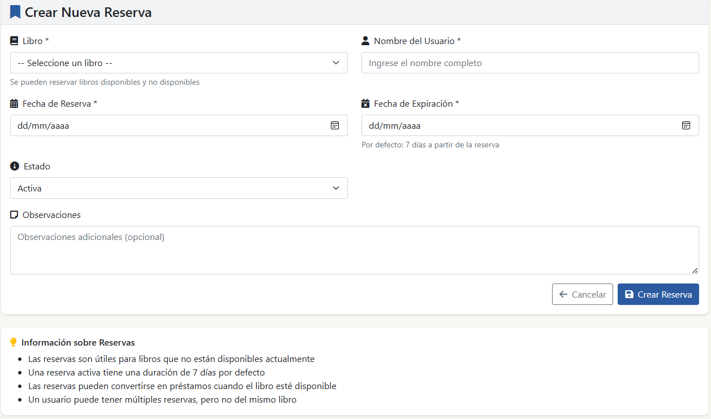

# 📚 Sistema de Biblioteca

Sistema web para gestión de bibliotecas desarrollado con **ASP.NET Core MVC**, **Entity Framework Core** y **SQLite**. Permite administrar libros, préstamos y reservas, con funcionalidades CRUD completas y una interfaz sencilla e intuitiva.

---

## 🛠️ Tecnologías

- ASP.NET Core 6.0 MVC
- Entity Framework Core
- SQLite Database
- Bootstrap 5
- Font Awesome

---

## ⚙️ Configuración e Instalación

### 📌 Prerequisitos

- .NET 6.0 SDK o superior
- Visual Studio 2022 o VS Code

### 🚀 Pasos de instalación

1. **Clonar el repositorio**
```bash
git clone <url-del-repositorio>
cd SistemaBiblioteca
```

2. **Restaurar paquetes NuGet**
```bash
dotnet restore
```

3. **Crear la base de datos**
```bash
dotnet ef migrations add Initial
dotnet ef database update
```

4. **Ejecutar la aplicación**
```bash
dotnet run
```

### 🌐 URLs de prueba

- Inicio: https://localhost:7028/
- Libros: https://localhost:7028/Libros
- Préstamos: https://localhost:7028/Prestamos
- Reservas: https://localhost:7028/Reservas

---

## 📂 Estructura del Proyecto

```
SistemaBiblioteca/
│
├── Controllers/               # Controladores MVC
│   ├── HomeController.cs
│   ├── LibrosController.cs      # CRUD completo (Create, Edit, Delete, Details)
│   ├── PrestamosController.cs   # CRUD completo
│   └── ReservasController.cs    # CRUD completo
│
├── Models/                    # Modelos de datos
│   ├── Libro.cs
│   ├── Prestamo.cs
│   ├── Reserva.cs
│   └── ErrorViewModel.cs
│
├── Data/                      # Contexto de BD y carga de datos
│   ├── BibliotecaContext.cs
│   └── SeedData.cs
│
├── Views/                     # Vistas Razor
│   ├── Home/                  # Página principal
│   │   └── Index.cshtml
│   ├── Libros/                # CRUD de libros
│   │   ├── Create.cshtml
│   │   ├── Edit.cshtml
│   │   ├── Delete.cshtml
│   │   ├── Details.cshtml
│   │   └── Index.cshtml
│   ├── Prestamos/             # CRUD de préstamos
│   │   ├── Create.cshtml
│   │   ├── Edit.cshtml
│   │   ├── Delete.cshtml
│   │   ├── Details.cshtml
│   │   └── Index.cshtml
│   ├── Reservas/              # CRUD de reservas
│   │   ├── Create.cshtml
│   │   ├── Edit.cshtml
│   │   ├── Delete.cshtml
│   │   ├── Details.cshtml
│   │   └── Index.cshtml
│   └── Shared/                # Layout y parciales
│       ├── _Layout.cshtml
│       ├── _Header.cshtml
│       ├── _Footer.cshtml
│       ├── Error.cshtml
│       └── ...
│
├── wwwroot/                   # Archivos estáticos
│   ├── css/ (site.css)
│   ├── js/  (site.js)
│   ├── imagenes/
│   └── lib/
│
├── appsettings.json           # Configuración
├── biblioteca.db              # Base de datos SQLite
└── Program.cs                 # Configuración principal
```

---

## 📊 Datos de Prueba

El sistema incluye datos precargados automáticamente mediante SeedData.cs:

- 15 libros de diferentes géneros
- 5 préstamos de ejemplo
- 5 reservas activas

---

## ✅ Funcionalidades

- CRUD de libros (crear, editar, eliminar, detalles)
- Búsqueda de libros por título y autor
- Gestión de préstamos
- Gestión de reservas
- Interfaz responsive con Bootstrap
- Validaciones en servidor y cliente

---

## 📸 Capturas de la Interfaz

### 🏠 **Página Principal**


### 🔍 **Búsqueda de Libros**


### 📚 **Colecciones de Libros**


### ➕ **Añadir Nuevo Libro**


### 📖 **Información del Libro**


### 📑 **Gestión de Préstamos**


### ✏️ **Registrar Préstamo**


### 🗂️ **Gestión de Reservas**


### 📝 **Crear Nueva Reserva**


---

## 🛠️ Solución de Problemas Comunes

### ⚠️ Error: no se encuentra la base de datos
Ejecuta los siguientes comandos para recrearla:
```bash
dotnet ef database update
```

### ⚠️ Los estilos no cargan
Verifica que la carpeta wwwroot/lib tenga las dependencias de Bootstrap y Font Awesome.

### ⚠️ Error en migraciones
Elimina la carpeta Migrations/ y vuelve a ejecutar:
```bash
dotnet ef migrations add Initial
dotnet ef database update
```

---

## 🚀 Próximas Mejoras

- 🔐 Sistema de autenticación de usuarios
- 👥 Roles (administrador, lector)
- 📅 Gestión de fechas de devolución con alertas
- 📊 Reportes de libros más prestados
- 🌐 Integración con API externa de libros (ej. Google Books)

---

## 🤝 Contribuciones

¡Las contribuciones son bienvenidas! 🎉

Para contribuir:

1. Haz un fork del repositorio
2. Crea una nueva rama (git checkout -b feature/nueva-funcionalidad)
3. Realiza tus cambios y haz commit (git commit -m 'Agrego nueva funcionalidad')
4. Haz push a la rama (git push origin feature/nueva-funcionalidad)
5. Crea un Pull Request

---

## 👨‍💻 Desarrollado por

**Daniel Esteban Mateus Velásquez**  
📧 [daniel.mateus20022@gmail.com]  
💼 [DanMox-24]
